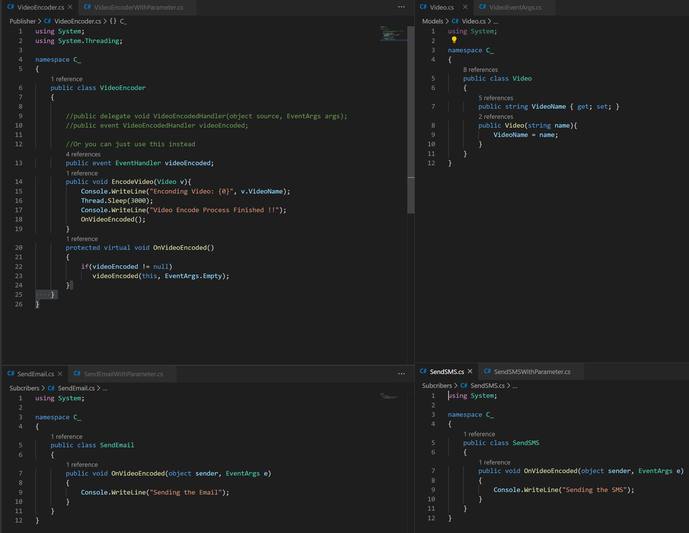
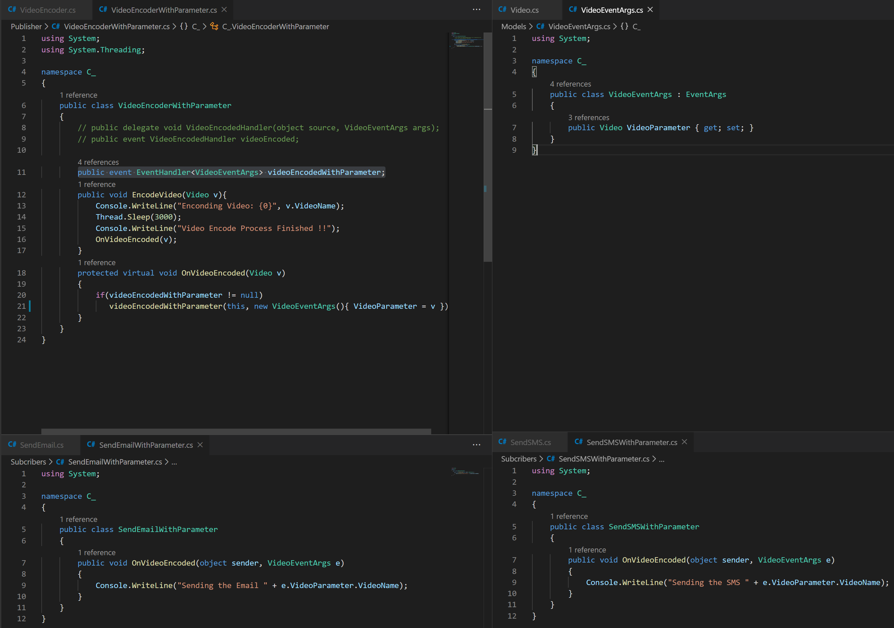

# Event Handler and Delegate in C#
For what ? 
* Loosely couple architecture
* Easy to test

#What is in the code ?
	There are 2 type of Event Handler, the one with no parameter and the one with code inside it
#No Parameter

*Create a delegate
*Create an Event Handler based on that delegate
*Raise the Event

#With Parameter

*Create a delegate but with a class which inheritances a custom EventArgs as second parameter
*Create an EventHanlder base on the above Delegate
*Require the trigger method with the parameter we need
*Raise the Event

#Better Way
In the new C# version we don't need to do this 
```
         	public delegate void VideoEncodedHandler(object source, VideoEventArgs args);
        	 public event VideoEncodedHandler videoEncoded;
```
Instead just to this
```
	public event EventHandler<VideoEventArgs> videoEncodedWithParameter;
```
#Execute the example
```
        static void Main(string[] args)
        {
            //Event with no Parameter

            Video v = new Video("Family Guy");
            var VE = new VideoEncoder();
            var SE = new SendEmail();
            var SS = new SendSMS();
            VE.videoEncoded += SE.OnVideoEncoded;
            VE.videoEncoded += SS.OnVideoEncoded;
            VE.EncodeVideo(v);


            //Event with Parameter
            Video v1 = new Video("Fuck you Peter");
            var VEP = new VideoEncoderWithParameter();
            var SEP = new SendEmailWithParameter();
            var SSP = new SendSMSWithParameter();
            VEP.videoEncodedWithParameter += SEP.OnVideoEncoded;
            VEP.videoEncodedWithParameter += SSP.OnVideoEncoded;
            VEP.EncodeVideo(v1);
        }
```
  